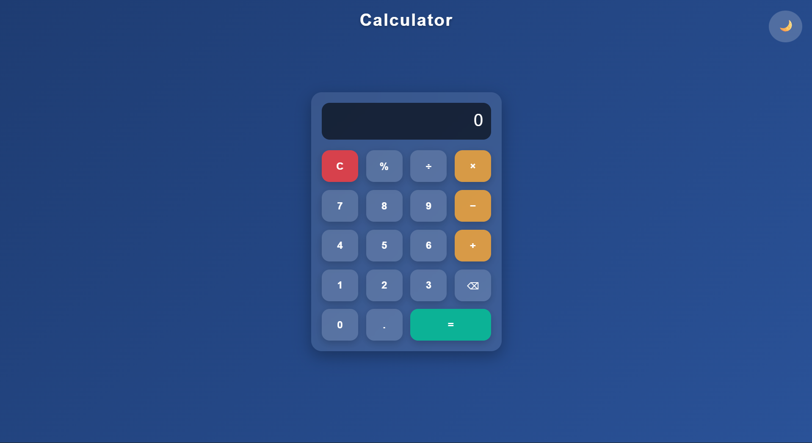

# 🧮 Calculator Project

A modern, responsive calculator built using **HTML, CSS, and JavaScript**.  
This project was developed as part of my internship task at **Pinnacle Labs**.

---

## ✨ Features
- Clean and modern **UI design**
- **Light/Dark mode toggle** 🌞🌙
- Smooth **button animations** and **result popping effect**
- Fully responsive — works on desktop and mobile
- Supports basic arithmetic operations (+, −, ×, ÷, %)

---

## 🚀 Live Demo
🔗 [View Calculator on GitHub Pages](https://shrihari1705-nbg.github.io/calculator-project/)  

---

## 📂 Project Structure

---

## 🖼️ Screenshot


---

## 🛠️ Tech Stack
- **HTML5**
- **CSS3 (Flexbox, Animations)**
- **JavaScript (DOM Manipulation)**

---

## 📌 How to Run Locally
1. Clone the repository:
   ```bash
   git clone https://github.com/Shrihari1705-NBG/calculator-project.git

---
